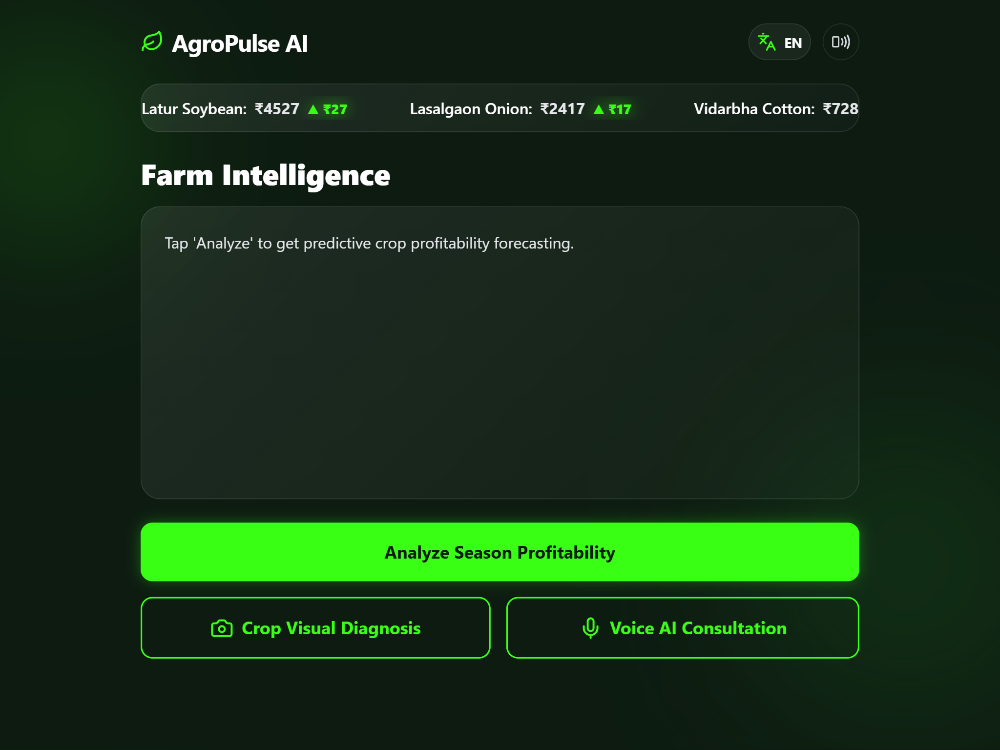
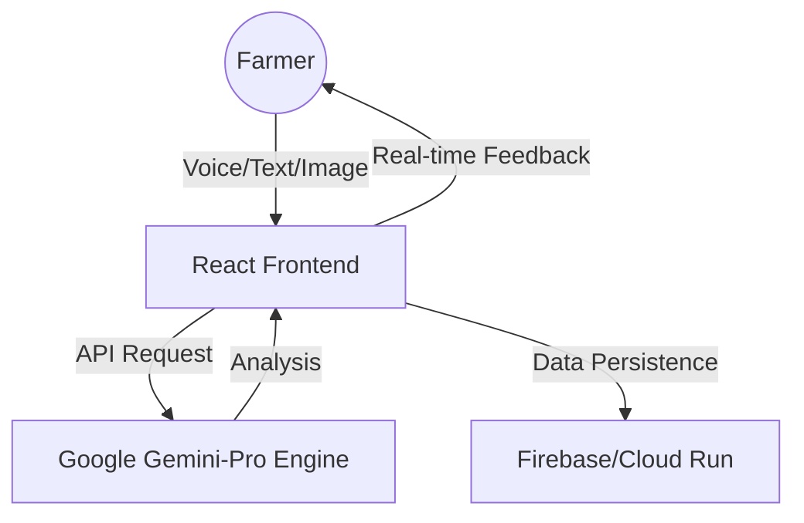

# AgroPulse AI 🌾 | Agentic COO for Indian Farmers

[](https://github.com/mramansayyad/AgroPulse-AI/actions/workflows/ci.yml)
[](https://opensource.org/licenses/MIT)
[](https://vitejs.dev/)
[](https://react.dev/)
[](https://deepmind.google/technologies/gemini/)

Built by **Team CYBER NOVA** for the **Google Solution Challenge 2026**.



AgroPulse AI is a sophisticated "Agentic Chief Operating Officer" designed to empower Indian smallholder farmers through accessible, voice-first, and highly intelligent agricultural insights. It bridges the digital divide by operationalizing advanced GenAI infrastructure for rural Bharat.

---

## 📖 Table of Contents
- [Mission Alignment (SDGs)](#-mission-alignment-sdgs)
- [Key Features](#-key-features)
- [System Architecture](#-system-architecture)
- [Tech Stack](#-tech-stack)
- [Getting Started](#-getting-started)
- [Project Structure](#-project-structure)
- [Contributing](#-contributing)
- [License](#-license)

---

## 🎯 Mission Alignment (SDGs)
AgroPulse AI is a purpose-driven architecture designed to accelerate the United Nations Sustainable Development Goals:

*   🚜 **SDG 1 (No Poverty):** Empowering farmers with localized, data-driven Predictive Crop Profitability forecasting to maximize ROI in regional agro-climatic zones.
*   🍎 **SDG 2 (Zero Hunger):** Cutting-edge visual diagnostics through 'Snap & Analyze' flow for rapid identification of crop diseases common in Indian soil.
*   🚀 **SDG 9 (Industry, Innovation, and Infrastructure):** Bringing elite AI capabilities to rural areas through low-bandwidth optimized interfaces.

---

## ✨ Key Features
- **Multilingual Support:** Native support for English, Hindi, and Marathi.
- **Voice-First Interface:** Designed for accessibility in rural areas where literacy levels vary.
- **Visual Diagnostics:** Upload or capture images of crops for instant disease identification using Gemini's vision capabilities.
- **Predictive Analytics:** Market trend analysis and profit forecasting tailored to regional data.
- **Agri-Noir Aesthetic:** A premium glassmorphism UI designed for high readability under direct sunlight.

---

## 🏗 System Architecture



---

## 🛠 Tech Stack
- **Frontend:** React 19, Vite, TailwindCSS v4.
- **AI Engine:** Google Gemini-Pro (via `@google/generative-ai`), utilizing Stable v1 Production API.
- **Infrastructure:** Firebase Hosting, Google Cloud Run (Dockerized).
- **Testing:** Vitest, React Testing Library.
- **CI/CD:** GitHub Actions.

---

## 🚀 Getting Started

### Prerequisites
- Node.js (v20 or higher)
- npm or yarn
- Google Gemini API Key

### Installation
1.  **Clone the repository**:
    ```bash
    git clone https://github.com/mramansayyad/AgroPulse-AI.git
    cd AgroPulse-AI/app_build
    ```

2.  **Install Dependencies**:
    ```bash
    npm install
    ```

3.  **Configure Environment**:
    Create a `.env` file in the root of `app_build`:
    ```env
    VITE_GEMINI_API_KEY=your_gemini_api_key_here
    ```

4.  **Launch Application**:
    ```bash
    npm run dev
    ```
    Navigate to `http://localhost:5173/`.

---

## 📁 Project Structure
```text
app_build/
├── .github/          # CI/CD and Issue Templates
├── src/
│   ├── components/   # Reusable UI components
│   ├── services/     # API and Firebase configurations
│   ├── __tests__/    # Vitest suites
│   └── App.jsx       # Main application logic
├── public/           # Static assets
└── Dockerfile        # Production container config
```

---

## 🤝 Contributing
Contributions are what make the open source community such an amazing place to learn, inspire, and create. Any contributions you make are **greatly appreciated**.

Please see [CONTRIBUTING.md](CONTRIBUTING.md) for details.

---

## ⚖️ License
Distributed under the MIT License. See [LICENSE](LICENSE) for more information.

---

<p align="center">
  Made with ❤️ by <b>Team CYBER NOVA</b>
</p>
